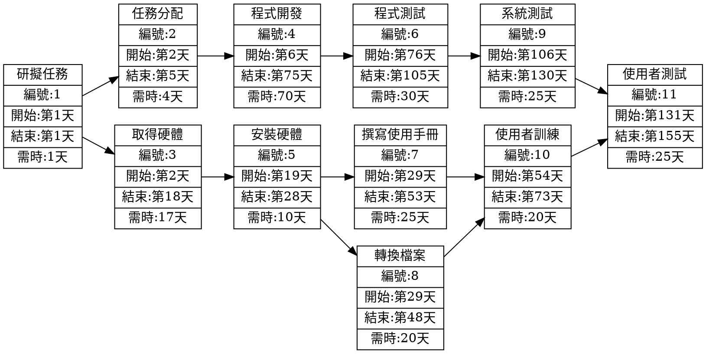
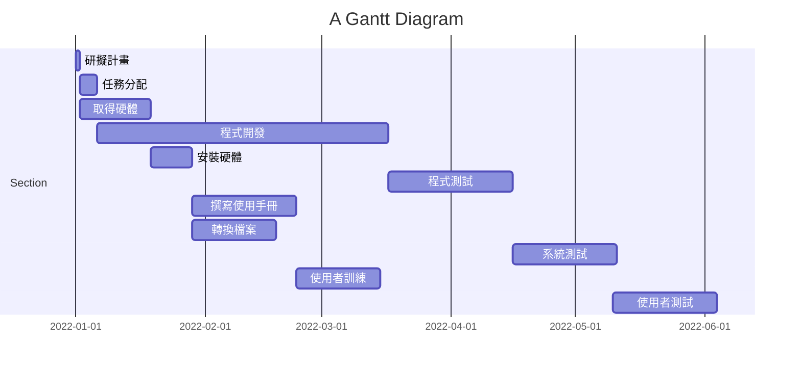

```graphviz
digraph {
	node[shape=record];
	rankdir="LR";
    no1 [label = "研擬任務 | 編號:1 | 開始:第1天 | 結束:第1天 | 需時:1天"]
    no1 -> no2
    no1 -> no3
    no2 [label = "任務分配 | 編號:2 | 開始:第2天 | 結束:第5天 | 需時:4天"]
    no2 -> no4
    no3 [label = "取得硬體 | 編號:3 | 開始:第2天 | 結束:第18天 | 需時:17天"]
    no3 -> no5
    no4 [label = "程式開發 | 編號:4 | 開始:第6天 | 結束:第75天 | 需時:70天"]
    no4 -> no6
    no5 [label = "安裝硬體 | 編號:5 | 開始:第19天 | 結束:第28天 | 需時:10天"]
    no5 -> no7
    no5 -> no8
    no6 [label = "程式測試| 編號:6 | 開始:第76天 | 結束:第105天 | 需時:30天"]
    no6 -> no9
    no7 [label = "撰寫使用手冊 | 編號:7 | 開始:第29天 | 結束:第53天 | 需時:25天"]
    no8 [label = "轉換檔案 | 編號:8 | 開始:第29天 | 結束:第48天 | 需時:20天"]
    no7 -> no10
    no8 -> no10
    no9 [label = "系統測試 | 編號:9 | 開始:第106天 | 結束:第130天 | 需時:25天"]
    no10 [label = "使用者訓練 | 編號:10 | 開始:第54天 | 結束:第73天 | 需時:20天"]
    no11 [label = "使用者測試 | 編號:11 | 開始:第131天 | 結束:第155天 | 需時:25天"]
    no9 -> no11
    no10 -> no11

    
}
```

### Mermaid

以2022/01/01為始

```mermaid
gantt
    title A Gantt Diagram

    section Section
    研擬計畫 : a1, 2022-01-01 , 1d
    任務分配 : a2, 2022-01-02 , 4d
    取得硬體 : a3, 2022-01-02 , 17d
    程式開發 : a4, 2022-01-06 , 70d
    安裝硬體 : a5, 2022-01-19 , 10d
    程式測試 : a6, 2022-03-17 , 30d
    撰寫使用手冊 : a7, 2022-01-29 , 25d
    轉換檔案 : a8, 2022-01-29 , 20d
    系統測試 : a9, 2022-04-16, 25d
    使用者訓練 : a10, 2022-02-23 , 20d
    使用者測試 : a11 , 2022-05-10 , 25d
    
``` 
     